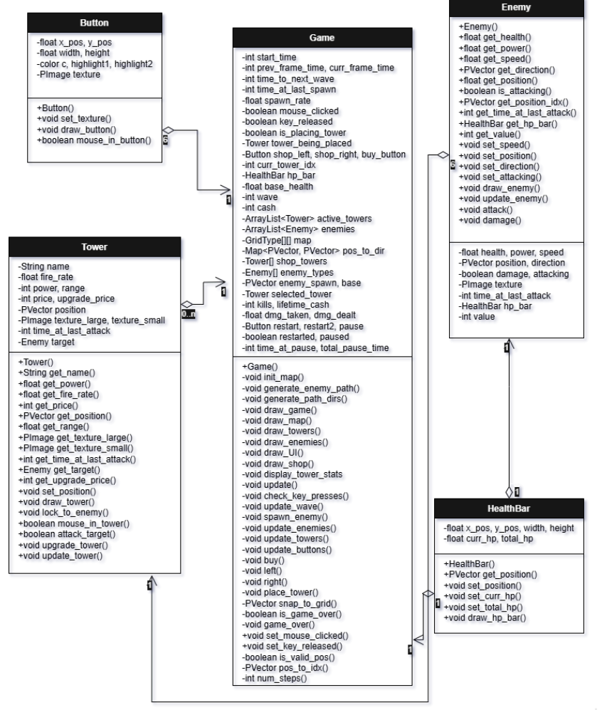

# tower-defense-processing
A tower defense game created using Processing.
**Intro**

Period: 6
Name: Jake Liu
Project Title: Tower Defense

**Description**

This is my rendition of a tower defense game. Players will use cash earned from killing slimes in order to buy towers and build a strategy to defend the base against an onslaught of slimes. As the game progresses, the number of slimes and level of difficulty will increase as stronger slimes spawn. Try your best to survive for as many waves as you can!

**Functionalities:**

Random Map Initialization
Random enemy spawn at the top or left of the map; base located at the opposite side
A random path is generated between the enemy spawn and base
Currency System
Cash can be used to buy towers or upgrade tower stats
Players earns cash by killing slimes
Tower Shop
An arsenal of towers that players can buy with cash
Towers with better stats require more cash
Window style - use buttons to navigate the shop
Tower Placement
Use the mouse to choose a location (snapped to an invisible grid) to place the tower after pressing the buy button
A hologram shows the possible location for the tower
Is tinted red if placing on an invalid location
Waves
A countdown tells the player when the next wave will come in
Wave number is also displayed
Increasing wave numbers lead to more difficulty (stronger slimes)
Health
Base health and enemy health are visually displayed
Enemy Spawning
Enemy Movement
Enemies will follow the path (colored brown)
Enemy Attacks
Enemies do damage to the base
Tower Attacks
Towers do damage to enemies
Display Tower Stats
When the player clicks on a placed tower, an info box will display its stats
Upgrade Tower Stats
Players can use cash to upgrade tower stats
Game Over Screen
Once the player base reaches 0 health, the game is over and game stats will be displayed

**UML Diagram**

**How does it work?**

When you press play, it will start you on wave 1, which introduces basic mobs and gives players time to understand game mechanics and develop a winning strategy. The user interface is meant to be easy to understand and self-navigable. As the wave number increases, the difficulty level and variety of mobs will increase. Killing mobs will give the player currency, which the player can use to make upgrades or buy power ups. The goal is to keep the base safe for as long as possible and have fun!

**Functionalities**

**Current Functionalities**
Random Map Initialization
Currency System
Tower Shop
Tower Placement
Wave Countdown
Health
**Planned Functionalities (by Meeting 2)**
Enemy Spawning
Enemy Movement
Enemy Attacks
Progression of Game Through Waves
Tower Attacks
Display Tower Stats
Upgrade Tower Stats
Game Over Screen

**Issues**

Enemy spawning doesn’t fully work yet; it doesn’t spawn at the designated spawn location, and does not move according to the path
